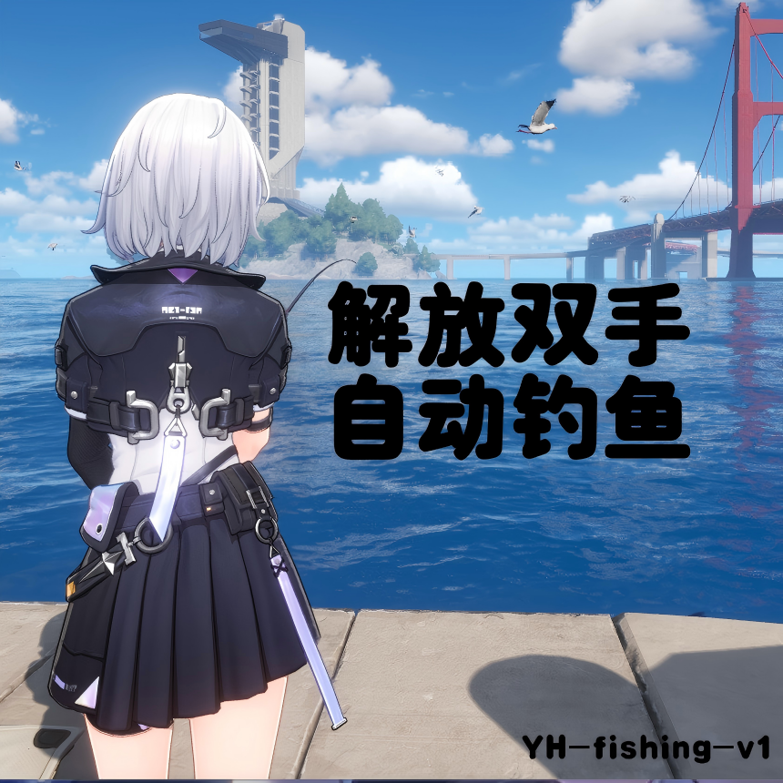
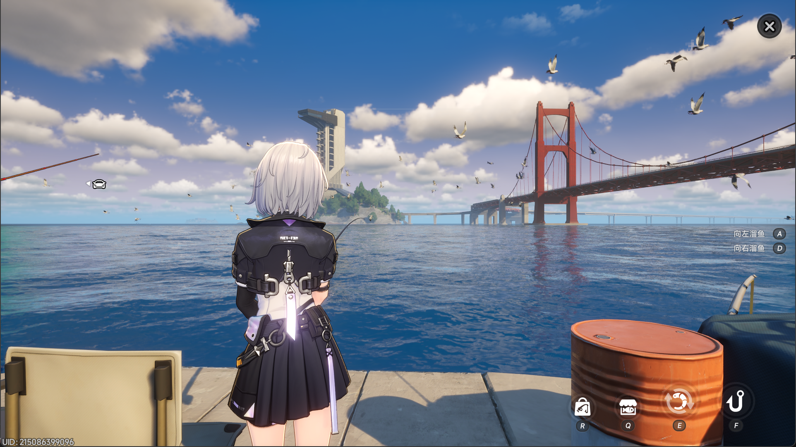

# Yi Huan 自动钓鱼脚本

---



> [!NOTE]
> **速览**
> 仅支持在 Windows 设备上运行，且运行过程中不能操纵电脑设备。需要 uv 环境与 python 知识，对于熟练使用 uv 包管理工具的用户，您可以直接跳转至第二章。本脚本运行在16：9的游戏窗口下，可通过 `uv run python -m autofish.pipeline` 一键启动！祝您玩得开心！落雨庭钓鱼点不可用，其他掉点几乎稳定可用！

## 1. 环境准备（Windows + 中国大陆）

### 1.1 安装 Python

- 建议 Python 3.12+（推荐 3.14）。
- 安装后可在终端检查：`python --version`

### 1.2 安装 uv

优先方案（官方安装脚本）：

```powershell
powershell -ExecutionPolicy ByPass -c "irm https://astral.sh/uv/install.ps1 | iex"
```

如果网络较慢，可用 PyPI 镜像安装：

```powershell
pip install -U uv -i https://pypi.tuna.tsinghua.edu.cn/simple
```

### 1.3 给 uv 配置国内源（建议）

在 PowerShell 执行（仅当前终端生效）：

```powershell
$env:UV_DEFAULT_INDEX = "https://pypi.tuna.tsinghua.edu.cn/simple"
```

> 说明：这样后续 `uv run` 拉依赖会优先使用国内源，首次启动更稳。

---

## 2. 一键运行

### 2.1 你只需要关注的配置项

配置文件：`autofish/config.py`  
普通用户只需要看这 5 项：

1. `SCREEN_MODE`: 只支持 `"16:9"` 和 `"8:5"`  
  - 推荐游戏窗口比例改成 **16:9**（1920x1080、2560x1440、3840x2160 等），对于 **8:5** 目前只测试了 2560x1600 ，对于其他窗口比例暂不支持。
2. `KEY_START_OR_CATCH`: 默认 `f`  
  - 如果你游戏里“抛竿/收杆”不是 F，改成你的键位。
3. `KEY_MOVE_LEFT`: 默认 `d`
4. `KEY_MOVE_RIGHT`: 默认 `a`  
  - 如果黄条移动方向反了，或者总往一边跑，直接把 `a/d` 对调。这里其实是变量名写错了，导致 LEFT 对应了 d 。
5. `DEBUG`: 默认 `False`，如果你遇到任何bug，欢迎打开DEBUG模式，并将终端输出与 `runs/audit/` 下面的输出贴给我看，这有助于我们发现问题并持续改进！

### 2.2 启动前游戏状态

1. 先把游戏切到可钓鱼状态（参考下图）。  
   
2. 尽量把游戏时间调到 **18:00**，这样可以更稳定地一直钓鱼。  
   - 实测 `14:00-17:00` 这个区间会有概率钓不上鱼。  
3. 不要遮挡游戏窗口，或者你在终端启动脚本后，立刻把游戏窗口切到前台。

### 2.3 启动命令

在项目根目录执行：

```powershell
uv run python -m autofish.pipeline
```

启动后不要再操作电脑，任何操作都可能导致脚本失败。

### 2.4 如何停止

1. 先在游戏里**狂按 ESC**，让角色退出钓鱼场景。  
2. 再回到终端按 **Ctrl + C** 结束脚本。

---

## 3. 给高级用户：系统设计与可扩展点（这部分AI生成，本人时间有限请见谅）

### 3.1 设计框架（两级感知 + 状态机驱动）

整体是“**模型识别状态** + **传统视觉控条**”的组合：

- 一级（全局识别）：MobileNet 识别当前处于哪个钓鱼阶段。
- 二级（局部控制）：进入拉扯阶段后，使用传统 CV 检测绿条/黄条并实时按键。
- 核心调度：状态机控制何时按 F、何时左右控条、何时点击结算、何时异常恢复。

这样做的好处：

- 纯模型不擅长高频连续控制；纯阈值又不稳。
- 两者结合后，阶段判断鲁棒，控条延迟低。

### 3.2 `autofish` 组件说明

- `autofish/pipeline.py`  
  主循环：抓帧、异步预测、状态机 step、限帧与日志。

- `autofish/window_capture.py`  
  查找目标窗口（标题/类名关键字）、激活窗口、抓取客户区图像。

- `autofish/mobilenet.py`  
  加载 `runs/model/best.pt`，把多个 ROI 拼成 320x320 复合图做分类；提供异步预测器。

- `autofish/state.py`  
  状态机核心，负责阶段流转、按键触发、异常恢复和后处理策略。

- `autofish/fight.py`  
  战斗条控制器：绿条检测 + 黄条检测 + 键盘按住/释放逻辑。  
  当前黄条方案是：  
  **颜色初筛 + 绿条附近窄带 + 细竖线几何约束 + 列组兜底**。

- `autofish/config.py`  
  所有可调参数集中管理（窗口比例、按键映射、阈值、FPS、超时等）。

- `autofish/audit.py`  
  日志与调试输出（含状态迁移、预测、FPS、异常信息）。

### 3.3 状态机（便于二次开发）

运行态：

- `waiting_for_start`：等待“可开始钓鱼”界面，按 `KEY_START_OR_CATCH` 进入下一步。
- `waiting_for_fish`：等待咬钩；识别到 `catching_fish` 后再按一次 `KEY_START_OR_CATCH` 进入拉扯。
- `fighting_with_fish`：高频传统视觉控制（黄条相对绿条位置决定按 A/D 或释放）。
- `after_fighting`：钓鱼结束界面点击收尾。
- `post_fight_verify`：传统检测退出后做短暂模型复核，避免误退。

异常策略：

- 传统检测连续丢失达到阈值后，回退到模型复核。
- 如果状态不一致或超时，进入 `recover_from_exception`，尝试回到可继续状态。

---

## 4. 模型训练说明（`runs/model` 来源）

训练脚本：`src/train.py`  
训练命令示例（脚本头注释同款）：

```bash
python src/train.py --data ./dataset --out ./runs/fishing_mobilenetv3 --epochs 30 --batch-size 32 --size 320
```

训练方法要点：

- 基础网络：`mobilenet_v3_small`
- 迁移学习：先冻结 backbone 若干 epoch，再解冻微调
- 数据划分：分层抽样（stratified split）
- 损失函数：带类别权重的交叉熵（缓解类不平衡）
- 输入组织：`ImageFolder` 目录结构（每个类别一个子目录）

本项目当前模型数据规模与效果：

- 训练集：1600 张
- 测试集：400 张
- 最终准确率：99.35%

### 关于标签里的空格小失误

`runs/model/labels.json` 里你有一个标签写成了：

- `1_waiting_for _fish`（`for` 后多了空格）

代码在 `autofish/state.py` 中用 `normalize_label()` 做了兼容：

- 会对标签 `strip()` 并移除空格再比较  
- 所以运行时仍能正确映射到 `waiting_for_fish`

这属于可兼容的训练标签噪声，不会直接导致流程错误；后续重训时修正目录名即可。

---

## 5. 常见问题速查

- 黄条方向反了：交换 `KEY_MOVE_LEFT` 与 `KEY_MOVE_RIGHT`
- 抛竿键位不对：修改 `KEY_START_OR_CATCH`
- 检测经常错位：先确认 `SCREEN_MODE` 与窗口比例一致（建议 16:9）
- 启动后没反应：确认游戏窗口标题关键字匹配且窗口在前台

## 6. 问题反馈

欢迎任何issue，或者邮箱联系我！